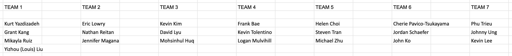

# c220_hackathon1

For this hackathon, you and your team will be collaborating to build a Connect Four game. A description of the basic game rules can be found [here](https://en.wikipedia.org/wiki/Connect_Four#Gameplay).

## Requirements

- The game must support at least two players.
- The game must automatically switch players after a player makes a move.
- The game must automatically end and declare a winner when the win condition is met.
- The game must offer to reset and begin a new game without refreshing the page.

## Stretch Features (optional)

- Keep track of the number of wins per player.
- Make a custom theme for the game (_e.g._ Star Wars, Naruto, or Pusheen).
- Add animations (_e.g_ when the player drops a disc into the game rack).
- Add a customizable time limit per turn.
- Allow players to choose an custom icon for their discs.
- Allow players to choose the dimensions of the game rack before starting a game.

### Groups

  

### Getting Started

**One** team member should create a new project on [MeisterTask](https://meistertask.com/app) and invite the other team members to collaborate. This is where your team will conduct task management for the hackathon. MeisterTask cards should be small action items.

### Coding Workflow

For this hackathon you will be collaborating with a small team of other developers and managing your source code with Git and GitHub. It is important that your team follow a strict workflow to keep everyone on the same page with respect to the project management and codebase.

1. First, **one** member of your team should fork this repository. They should share a link to the fork with every other team member.
2. Each member of your team should **clone** that **one** fork to their local `lfz/` directory. **💀 Do not fork the fork 💀**)
3. Each member of your team should check out a new branch from the `master` branch for the changes that they are about to make. Do not work directly on the master branch!
4. When a team member has completed their changes, they should push their branch up to GitHub and make a new Pull Request to merge their changes into `master`. If there are merge conflicts, do the following.
    - Check out `master` locally.
    - `git pull origin master` to make sure you have the latest commits for `master`
    - Check out the branch you were working on.
    - `git merge master` to make sure that your own branch is up-to-date
    - Fix merge conflicts if there are any
5. Have a team member review and approve the Pull Request.
6. Merge the pull request.
7. Check out `master` locally.
8. `git pull origin master` to sync your local `master` to GitHub's `master`.
9. Repeat for a new set of changes.

### Submitting the Final Code

Once all of your team's changes are done, you'll want to turn in your work. This repository has one branch per group. You'll want to:

1. Go to your fork's repository on GitHub.com.
1. Go to the **Pull Requests** tab.
1. Click the **New Pull Request** button.
1. Select `Learning-Fuze/c220_hackathon1` as the `base` repository.
1. Select your team's branch as the `base` branch.
1. Select your fork as the `head` repository.
1. Select your `master` branch as the `compare` branch.
1. Click **Create Pull Request**.
